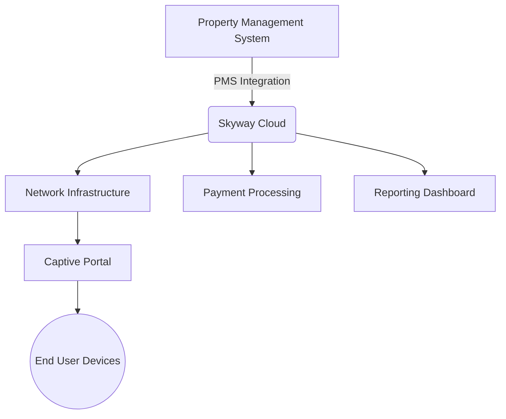

# skyadmin-agent


*Contents:*

- [Intro](#intro)
- [Agent](#agent)
- [Usage](#usage)
- [Background](#background)
    - [Problem](#problem)
    - [HTTP traffic](#http-traffic)
    - [Registration flow](#registration-flow)


## Intro

This is a golang based application that is designed to navigate [allbridge.com](https://allbridge.com/) splash pages and captive portals.  This is important for automated devices like servers which need to stay authenticated with a network without human interaction.


## Agent


The agent checks for internet connectivity by calling `http://detectportal.firefox.com/success.txt?ipv4` every 30 seconds..  If the agent gets a splash page insted of the actual connection check, then it attempts to first use a type of cached connection, and then attempts to authenticate.

The agent reads its configuration from environmental variables.  The available options are as follows:

```
LOG_LEVEL=debug
API_TOKEN=<32 char long hex string>
VLAN=<int>
MAC_ADDRESS=<mac without the ':'>
IP_ADDRESS=<str>
NSEID=<6 char long hex string>
LASTNAME=<str>
ROOMNUMBER=<int>
PROPERTYID=<int>
REGMETHODID=<int>
RATEPLANID=<int>
```


## Usage

You can run the agent directly with `go run .` but it is better to run in the the docker container.

You can run it with the following command:

`docker run ghcr.io/jlevere/skyadmin-agent:latest`

And example [docker-compose.yml](./docker-compose.yml) is also provided.

## Background

Skyway is a product of [allbridge.com](https://allbridge.com/) that connects things like proporty managment systems to wifi infrastructure.  The goal of this is to allow people to log into the wifi with their name and room number in a hotel or similar enviroment. The system can do other things as well such as building custom splash pages and general network usage monitoring for customers.

This is similar to, and possibly in conjunction with, a physical device like a Nomadix.

The domain Skyway uses for splash pages is [skyadmin.io](https://skyadmin.io).  It is also used as the interface for things such as customer payment and managment login.



### Problem

I find the overall system quite buggy as a user. I am unsure if this is an operator, implmentation or software issue. My experence consists of being randomly forced to reauthenticate with no pattern at all.  Adidtionaly, and maybe most frustratingly, sometimes devices will be "soft kicked" from the network.  They can still interact on wifi, and things like icmp still works fine.  But HTTP requests to some domains will timeout after dns resolution, making it dificult to tell when a device is actually connected or not.  To fix this, you must send a POST request to skyadmin.io with your mac and some other information.  There is no particular pattern to the timing of these "soft kicks" that I have been able to find.


### HTTP traffic

An example of a splash page url is as follows:

```
https://splash.skyadmin.io/?UI=da4c39&NI=8e39ad3c5f9f&UIP=66.215.127.26&MA=A4CA6DB82E0A&RN=PAN%20OnBoard%20Test&PORT=3100&RAD=no&PP=no&PMS=no&SIP=10.0.24.17&OS=http://detectportal.firefox.com%2Fsuccess.txt%3Fipv4
```
We can breakdown the url params for a better look at this:

```
UI=da4c39           <-  this is the ID (?) of a nomadix machine.
NI=8e39ad3c5f9f 
UIP=66.215.127.26
MA=A4CA6DB82E0A
RN=PAN%20OnBoard%20Test
PORT=3100
RAD=no
PP=no
PMS=no
SIP=10.0.24.17
OS=http://detectportal.firefox.com%2Fsuccess.txt%3Fipv4
```

From the first `GET` we recive a large blob of webpacked vue and react components and stuff.  It is really a mess.  But from this, we get a few things.  Most importantly, we
get what appears to be a hardcoded api key, deep in the page source: 

```js
production_endpoint = "https://skyadmin.io/api/",
dev_endpoint = "https://dev.skyadmin.io/api/",
token = "b2507058a2c145d60c6d919c0347fe9c",
C = R.a.create({
    baseURL: "splash.skyadmin.io" === window.location.host ? production_endpoint : dev_endpoint,
    headers: {
        "api-token": token
    },
    timeout: 3e4
}),
```
This js sends an `OPTIONS` request (???) and then `POST`s some json to `skyadmin.io/api/portals` that looks like this:

```json
{
    "vlan":"3100",
    "mac_address":"A4CA6DB82E0A",
    "ip_address":"10.0.24.17",
    "nseid":"da4c39"
}
```

The server responds with a few different messages depending on customer settings ofc.  In my case it looks like this on a successful login:


```json
{
    "data": {
        "id": 88760315 ,
        "property_id": 2162,
        "date": "02\/01\/25 4:08 AM UTC",
        "expired": "02\/25\/25 4:08 AM UTC",
        "expire_date": "02\/25\/25 4:08 AM",
        "last_action": "02\/01\/25 4:08 AM UTC",
        "registration_status": "Successful",
        "registration_method": {
            "registration_method_id": 6,
            "registration_method": "PAN Authentication",
            "registration_method_short": "SkyPMS"
        },
        "registration_action": "SkywayPMS login",
        "device": {
            "mac_address": "A4CA6DB82E0A",
            "ip_address": "10.0.24.17",
            "os": "Windows",
            "browser": "Firefox",
            "name": "0",
            "type": "Laptop"
        },
        "user": {
            "access_code": [],
            "first_name": null,
            "last_name": "<lastname>",
            "room_number": "<room num>",
            "email_address": null,
            "member": 0
        },
        "zone": "internal",
        "vlan_id": 8608,
        "vlan": {
            "vlan_id": 8608,
            "property_id": 2162,
            "vlan_name": "PAN Onboard 40210235",
            "port_location": "3100",
            "zone_type": "Internal",
            "nomadix_internal_id": 6,
            "max_bw_up": 15120,
            "max_bw_down": 15120
        },
        "rate_plan_id": 2345,
        "rate_plan": {
            "rateplan_id": 2345,
            "property_id": 2162,
            "rate_plan_name": "PAN onboarding",
            "rate_plan_description": null,
            "duration": 34560,
            "speed_download": 100,
            "speed_upload": 100,
            "price": "0.00",
            "tier": 0,
            "tier_description": "No tier structure exists for this plan",
            "additional_devices": null,
            "additional_devices_price": null,
            "idle_timeout": 0,
            "enable_mac_auth": 0,
            "enable_shared_bandwidth": 0,
            "marriottbundlecode": null,
            "has_vlans": 1
        },
        "conference_network_id": null,
        "selected_plan": null,
        "selected_plan_price": null,
        "bandwidth_down": 100000,
        "bandwidth_up": 100000,
        "error_message": null,
        "email_opt_in": 0,
        "auto_auth_status": null,
        "remember_device": null,
        "created_at_UTC": "2025-02-01T04:08:35.000000Z",
        "created_at": "2025-02-01 4:08:35 AM UTC",
        "updated_at": "2025-02-01 4:08:59 AM UTC"
    }
}
```

And this on a failure:

```json

{
    "data": {
        "vlan_id": 8608,
        "property_id": 2162,
        "vlan_name": "PAN Onboard 40210235",
        "port_location": "3100",
        "zone_type": "Internal",
        "nomadix_internal_id": 6,
        "max_bw_up": 15120,
        "max_bw_down": 15120,
        "access_codes": [],
        "access_code_groups": [],
        "registration_methods": [
            {
                "registration_method_id": 6,
                "registration_method": "PAN Authentication",
                "registration_method_short": "SkyPMS",
                "free": 1,
                "public": 1,
                "upsell": 0,
                "created_at": "2021-06-04T11:36:25.000000Z",
                "updated_at": "2021-06-04T11:36:34.000000Z",
                "rate_plans": [
                    {
                        "rateplan_id": 1234,
                        "property_id": 2162,
                        "rate_plan_name": "PAN onboarding",
                        "rate_plan_description": null,
                        "duration": 34560,
                        "speed_download": 100,
                        "speed_upload": 100,
                        "price": "0.00",
                        "tier": 0,
                        "tier_description": "No tier structure exists for this plan",
                        "additional_devices": null,
                        "additional_devices_price": null,
                        "idle_timeout": 0,
                        "enable_mac_auth": 0,
                        "enable_shared_bandwidth": 0,
                        "marriottbundlecode": null,
                        "has_vlans": 1,
                        "created_at": "2022-08-14T15:12:16.000000Z",
                        "updated_at": "2023-02-02T18:36:13.000000Z"
                    }
                ]
            }
        ],
        "template": {
            "template_id": 2345,
            "name": "PAN Onboard",
            "base": 0,
            "custom": 0,
            "custom_template_name": "",
            "color_background_body": "#F1F1F1",
            "color_background_button": "#842b2A",
            "color_background_logo": "#FFFF1F",
            "color_text_button": "#FFF1FF",
            "main_text": "Login to your network",
            "description_text": "Please follow the prompts to get your device onto your Network",
            "redirect_url": "https:\/\/www.theurbanohio.com\/",
            "consent_text": null,
            "enable_email_consent": 0,
            "optin_default": 0,
            "room_prefix": null,
            "support_phone": "",
            "custom_tos": "<centee to time.",
            "images_background": [],
            "images_inline": [
                {
                    "templateimage_id": 321,
                    "template_id": 3423,
                    "property_image_id": 456,
                    "url": "",
                    "type": "Inline",
                    "created_at": "2022-08-13T16:13:10.000000Z",
                    "updated_at": "2022-08-13T16:13:10.000000Z"
                }
            ],
            "logo": [],
            "conference_networks": [],
            "created_at": "2022-07-27T15:47:43.000000Z",
            "updated_at": "2022-07-27T15:47:43.000000Z"
        },
        "created_at": "2022-07-27T15:41:30.000000Z",
        "updated_at": "2022-07-27T15:47:43.000000Z"
    }
}
```


### Registration flow


Looking through the code, the registration flow is generally as follows:

1. Attempt to login with a `POST` to `/api/portals`

```json
{
    "vlan":"3100",
    "mac_address":"A4CA6DB82E0A",
    "ip_address":"10.0.24.17",
    "nseid":"da4c39"
}
```

If response does not contain `"registration_status": "Successful",` then we move to the next step 

2. We check for pin with a `POST` to `/api/skypms/pinrequired`

```json
{
    "property_id":2162,
    "lastname":"<lastname>",
    "roomnumber":"<room num>"
}
```

Its response looks like this:

```json
{
    "data":{
        "pin_required":true
    }
}
```

The webapp treats a `false` in the response as a user lookup error

```json
{
    "data": {
        "pin_required": false
    }
}
```

3. We do the actual registration with a `POST` to `/api/portalregistrations`

```json
{
    "nseid": "da4c39",
    "property_id": 2162,
    "vlan_id": 3456,
    "mac_address": "A4CA6DB82E0A",
    "ip_address": "10.0.24.17",
    "registration_method_id": 6,
    "rateplan_id": 2345,
    "last_name": "<lastname>",
    "room_number": "<room num>",
    "pin": "<pin value>"
}
```

The response to this is very simple:

```json
{
    "data": {
        "registration_status": "Successful",
        "url": "google.com",
        "error": ""
    }
}
```

or an error

```json
{
    "data": {
        "registration_status": "Failed",
        "url": "",
        "error": "Incorrect PIN provided"
    }
}
```
